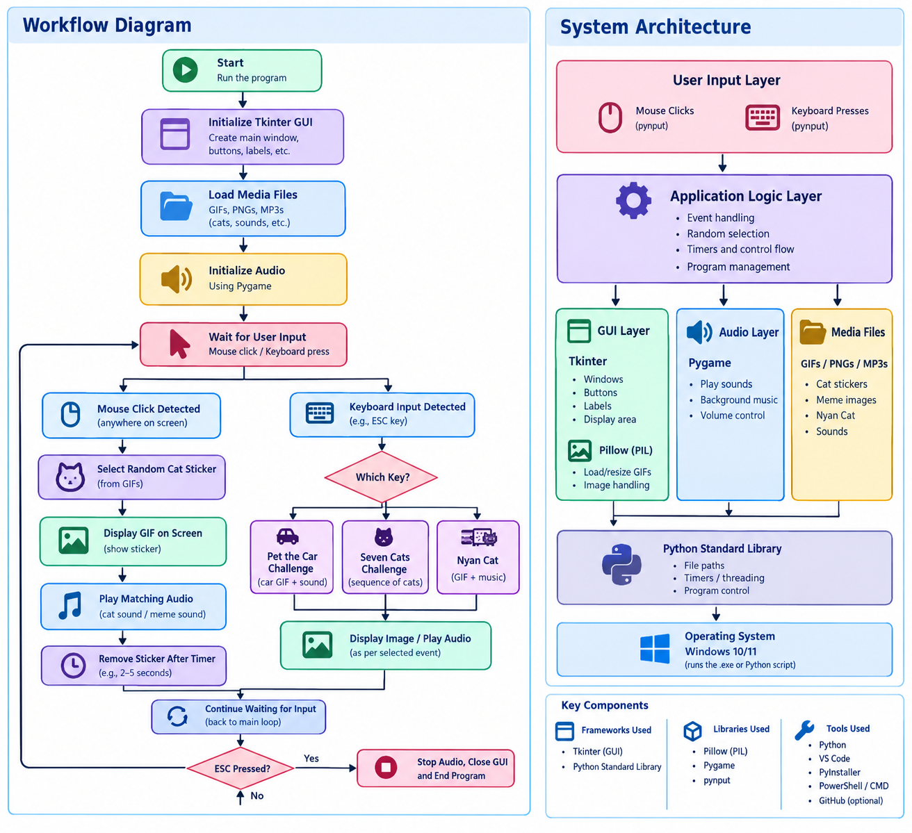

# [Meowmer?] 🎯

## Basic Details
### Team Name: [Parzival]

### Team Member(Solo)
-Kevin Joy Puliyani

### Project Description
[A cat meme bombing program. A random cat meme appears each time you click using your cursor]

### The Problem (that doesn't exist)
[People dont get enough dopamine in a day]

### The Solution (that nobody asked for)
[This program solves it by giving an instant serotonin boost]

## Technical Details
### Technologies/Components Used
For Software:
- [Python]
- [Tkinter, Python Frameworks library]
- [Pillow, Pygame, pynput]
- [Python, Visual Studio Code, Powershell,   GitHub,ChatGPT]

For Hardware:
- [List main components]
- [List specifications]
- [List tools required]

### Implementation
For Software:
# Installation
[commands]

# Run
[1.Open a terminal in the folder containing the file "main.py"
2. Enter "python main.py" in the terminal and run ]

### Project Documentation
For Software:

# Screenshots 
.png>)
*Program in use*

.png>)]
*More into the program interface*

.png>)]
*Easter egg. Use the program to find out :)*

# Diagrams
low]

For Hardware:

# Schematic & Circuit

*Add caption explaining connections*

*Add caption explaining the schematic*

### Project Demo
# Video
[Add your demo video link here]
*Explain what the video demonstrates*

# Additional Demos
[Add any extra demo materials/links]

## Team Contributions
- [Name 1]: [Specific contributions]
- [Name 2]: [Specific contributions]
- [Name 3]: [Specific contributions]

---
Made with ❤️ at TinkerHub Useless Projects 

